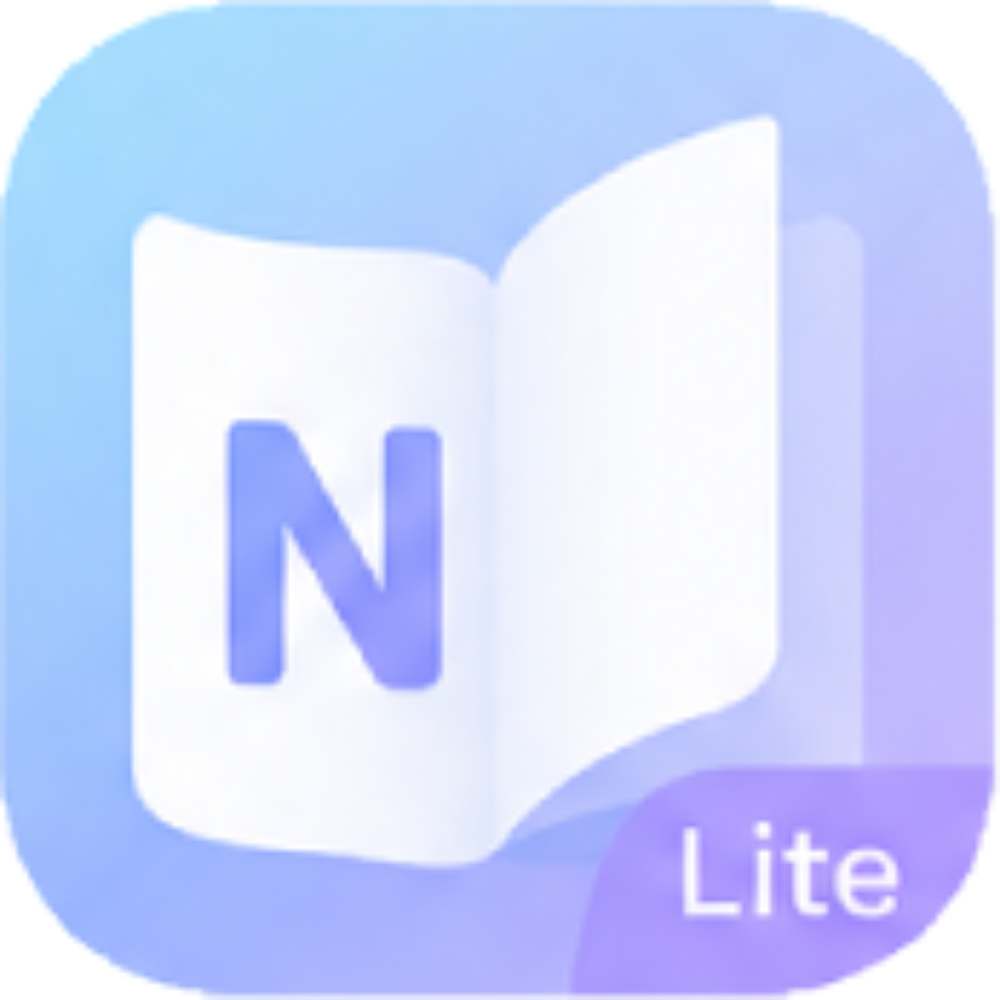

<p align="center">
  
</p>

<h1 align="center">NowenReader Lite</h1>

<p align="center">
  基于 <a href="https://github.com/cropflre/nowen-reader">NowenReader</a> 的轻量级 iOS 原生客户端
</p>

<p align="center">
  
  
  
</p>

---

## 功能特性

| 分类 | 功能 |
|------|------|
| 📚 书架 | 网格 / 列表视图切换、分页加载、排序筛选 |
| 📖 漫画阅读 | UIPageViewController 翻页、点击翻页（左/中/右三区域）、缩放、预加载 |
| 📕 小说阅读 | 分页渲染、字号调节、自动记忆阅读位置 |
| 📄 PDF 阅读 | PDFKit 渲染、缩放浏览 |
| 📁 合集管理 | 分组浏览、网格/列表切换 |
| 🔍 全文搜索 | 关键词搜索、结果列表 |
| ❤️ 收藏 | 一键收藏/取消 |
| 📊 阅读统计 | 阅读时长、进度追踪 |
| 🔄 进度同步 | 跨设备阅读进度同步 |
| 🌗 深色模式 | 自动跟随系统切换 |
| 📱 iPad 适配 | 全设备尺寸适配 |
| 🖥 多服务器 | 服务器列表管理、快速切换 |
| 📥 离线下载 | 漫画批量下载、断点续传、存储管理、下载时写入缓存 |
| 📡 离线模式 | 断网自动检测与切换、已下载内容阅读、合集离线浏览、进度离线暂存与联网自动同步、收藏/统计离线守卫 |
| 🤖 AI 超分辨率 | Anime4K / RealESRGAN 模型、实时超分、Tile 分块处理 |

## 技术栈

| 组件 | 技术选型 |
|------|----------|
| UI 框架 | SwiftUI + UIKit 桥接 |
| 架构模式 | MVVM |
| 网络层 | URLSession + async/await + Codable |
| 图片加载 | AuthenticatedImage（Cookie 认证） |
| 本地存储 | SwiftData |
| 密钥管理 | Keychain |
| 漫画阅读器 | UIPageViewController (.pageCurl) |
| PDF 阅读器 | PDFKit |
| 离线存储 | OfflineFileManager（文件系统 + JSON 元数据） |
| 网络监控 | NWPathMonitor + 服务器可达性测试 |
| AI 超分 | Core ML（Anime4K / RealESRGAN） |
| 最低版本 | iOS 17.0 |

## 项目结构

```
NowenReaderLite/
├── App/                        # 入口、路由、TabBar
│   ├── NowenReaderLiteApp.swift
│   ├── RootRouter.swift
│   └── MainTabView.swift
├── Core/
│   ├── Network/                # API 客户端、图片加载
│   │   ├── APIClient.swift
│   │   └── AuthenticatedImage.swift
│   ├── Services/               # 业务服务
│   │   ├── DownloadManager.swift    # 下载管理器
│   │   ├── OfflineFileManager.swift # 离线文件管理
│   │   ├── ImageCache.swift         # 图片缓存
│   │   ├── ChapterCache.swift       # 小说章节缓存
│   │   ├── ImageUpscaler.swift      # AI 超分辨率
│   │   └── PaginationService.swift  # 分页服务
│   ├── Storage/                # SwiftData、Keychain、阅读记录
│   │   ├── SwiftDataSchema.swift
│   │   ├── KeychainHelper.swift
│   │   ├── ReadingRecordManager.swift
│   │   └── PendingProgressManager.swift  # 离线进度暂存
│   └── Extensions/             # 工具扩展
├── Features/
│   ├── Auth/                   # 服务器配置、登录/注册、服务器列表
│   ├── Library/                # 书架首页、继续观看、内容列表
│   ├── Detail/                 # 漫画详情、合集详情
│   ├── Reader/                 # 漫画/小说/PDF 阅读器
│   ├── Search/                 # 全文搜索
│   ├── Favorites/              # 收藏管理
│   ├── Downloads/              # 下载列表管理
│   ├── Stats/                  # 阅读统计
│   └── Settings/               # 应用设置
├── Models/                     # Codable 数据模型
├── Assets.xcassets/            # 图片、图标资源
├── anime4k-4x-a-hq.mlpackage   # Anime4K 超分模型
├── RealESRGAN_x4plus_Anime.mlpackage  # RealESRGAN 超分模型
├── Info.plist
└── NowenReaderLite.xcodeproj/
```

## 快速开始

### 环境要求

- macOS + Xcode 15+
- iOS 17.0+ 模拟器或真机
- 一个运行中的 [NowenReader](https://github.com/cropflre/nowen-reader) 服务端

### 运行步骤

1. 用 Xcode 打开 `NowenReaderLite.xcodeproj`
2. 配置你的**签名证书**
3. 选择模拟器或真机，点击 **Run**
4. 首次启动输入 NowenReader 服务器地址
5. 注册 / 登录后即可使用

## 架构设计

```
┌─────────────────────────┐
│    iOS SwiftUI App      │
├─────────────────────────┤
│  UI / 阅读器 / 缓存层   │
│  ViewModel (MVVM)       │
│  API Client             │
└───────────┬─────────────┘
            │ RESTful API
┌───────────▼─────────────┐
│   NowenReader Server    │
├─────────────────────────┤
│  用户系统 / 书架 / 章节  │
│  图片 / EPUB / 数据管理  │
└─────────────────────────┘
```

**设计原则：**
- **API 驱动** — iOS 端不做任何解析逻辑，完全依赖服务端
- **强缓存** — SwiftData 本地缓存，提升加载体验
- **原生优先** — 纯 SwiftUI + UIKit，不复用 Web UI
- **UI 与数据解耦** — MVVM 分层，职责清晰
- **离线优先** — 断网时自动切换离线模式，已下载内容（含合集）可正常阅读，进度离线暂存、联网自动同步
- **自动恢复** — NWPathMonitor 持续监听网络变化，`.satisfied` 时自动重连、校验认证、刷新数据

## API 对接

<details>
<summary>点击查看完整 API 端点列表</summary>

| 模块 | 端点 |
|------|------|
| 认证 | `POST /api/auth/login` · `POST /api/auth/register` · `GET /api/auth/me` |
| 书架 | `GET /api/comics`（分页/排序/筛选） |
| 详情 | `GET /api/comics/:id` |
| 漫画 | `GET /api/comics/:id/pages` · `GET /api/comics/:id/page/:index` |
| 小说 | `GET /api/comics/:id/chapter/:index` |
| PDF | `GET /api/comics/:id/pdf` |
| 缩略图 | `GET /api/comics/:id/thumbnail` |
| 搜索 | `GET /api/comics?search=` |
| 收藏 | `POST/DELETE /api/comics/:id/favorite` |
| 合集 | `GET /api/groups` · `GET /api/groups/:id` |
| 统计 | `GET /api/stats` |
| 进度 | `POST /api/comics/:id/progress` · `POST /api/stats/session` |
| 健康检查 | `HEAD /api/health` |

</details>

## 修改记录

详见 [CHANGES.md](CHANGES.md)

## License

[GPL-3.0](LICENSE)
